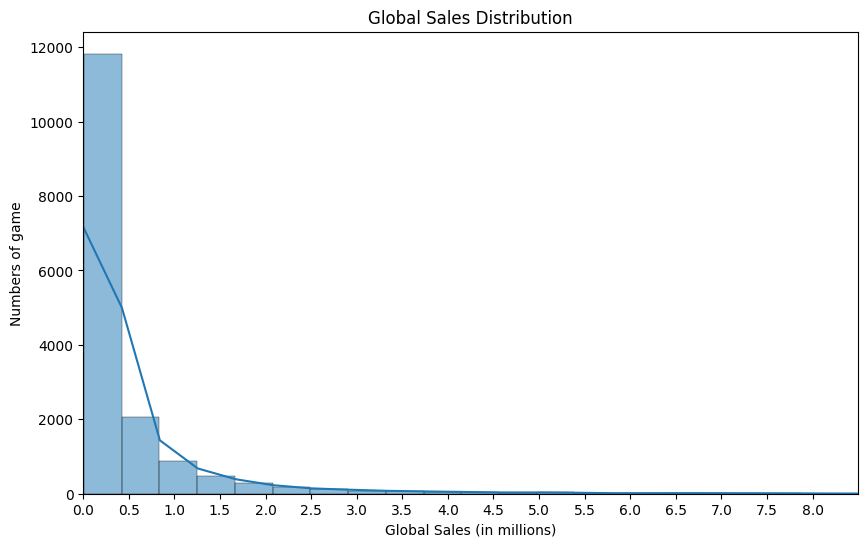
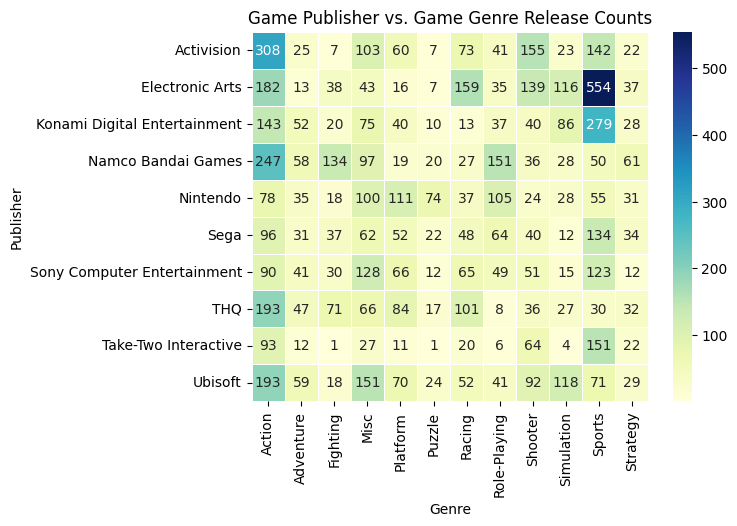
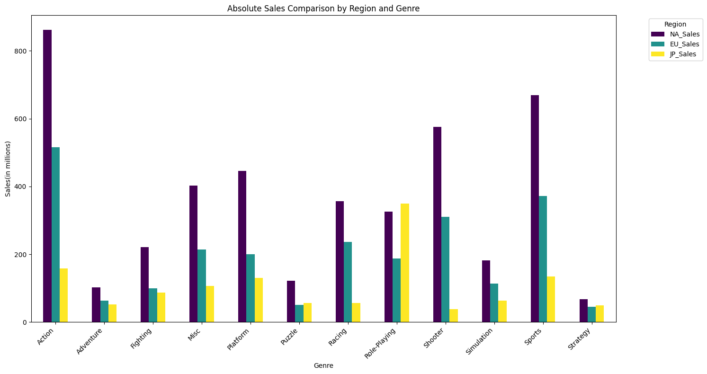

# Global Video Game Market Analysis (EDA)
## Project Overview
* A EDA project is to conduct a comprehensive analysis of the video game market to understand its core characteristics, identify key market winners, and determine the critical factors contributing to their success, ultimately aiming to generate actionable insights for future decision-making and pinpoint the most promising market segments for strategic entry.
---
## Highlighs
 I use three levels of analysis to help me found meaningful insights:
* **Univariate Analysis**: Explored the distribution of individual variables (e.g., Global Sales, Release Years).
* **Bivariate Analysis**: Investigated relationships between two variables (e.g., Genre vs. Game Publisher).
* **Multivariate Analysis**: Identified complex patterns across multiple dimensions. (e.g., Relationship between Sales ‘s region and Genre)
---
## Key Insighs
### 1. Univariate Analysis: Market Distribution & Trends
* **"Winner-takes-all" Environment:** The market is characterized by extreme imbalance. Sales are **highly right-skewed;** while mean sales are around **0.5M**, **over 75% of games** sell less than this figure, highlighting that successes are exceptions rather than the norm.

* **Genre Dominance:** **Action and Sports** hold a dominant position in release volume, with Action games outnumbering Sports titles by approximately **41%**.

### 2. Bivariate Analysis: Publisher Strategies
* **Quantity vs. Quality:** **Nintendo** leads the market by focusing on high game quality and average sales, whereas **EA** and **Activision** achieve success by releasing many games **(volume strategy)**

* **Market Positioning:** Heatmap analysis shows how major publishers focus resources on **specific strengths**. For example, EA heavily dominates the **Sports market**, while Nintendo focuses on **Platform and RPGs** to secure its position.

### 3. Multivariate Analysis: Regional Market Dynamics
* **Western Market Correlation:** There is a strong **positive correlation** between sales in North America Market and Europe Market. Games that perform well in one are highly likely to perform similarly in the other.

* **Independence of the Japanese Market:** In contrast, Japan Market shows **unique cultural preferences**. Shooter games are distinctly unpopular in Japan despite high global sales, the game types preferred in the Japanese market are significantly different from the global mainstream market.

  
Click to view Key Visualizations (Key Insighs)

   

  #### 1. Global Sales Distribution (Univariate)
  *Revealing the "Winner-takes-all" nature of the market.*
  

  #### 2. Market Positioning (Bivariate)
  *Heatmap of Game Publisher vs Game Genre*
  

  #### 3. Cross-regional Sales Trends (Multivariate)
  *Sales Comparison By Region And Genre*
  

---
### Quick Links
* [**View Analysis Notebook**](./EDA_project_with_plot.ipynb)
* [**Read Final Report (PDF)**](./EDA_Project_Report.pdf)
* [**Presentation Slides (PDF)**](./EDA_on_Electronic_game_PPT.pdf)
* [**Raw Dataset (CSV)**](./video_games_sales.csv)
